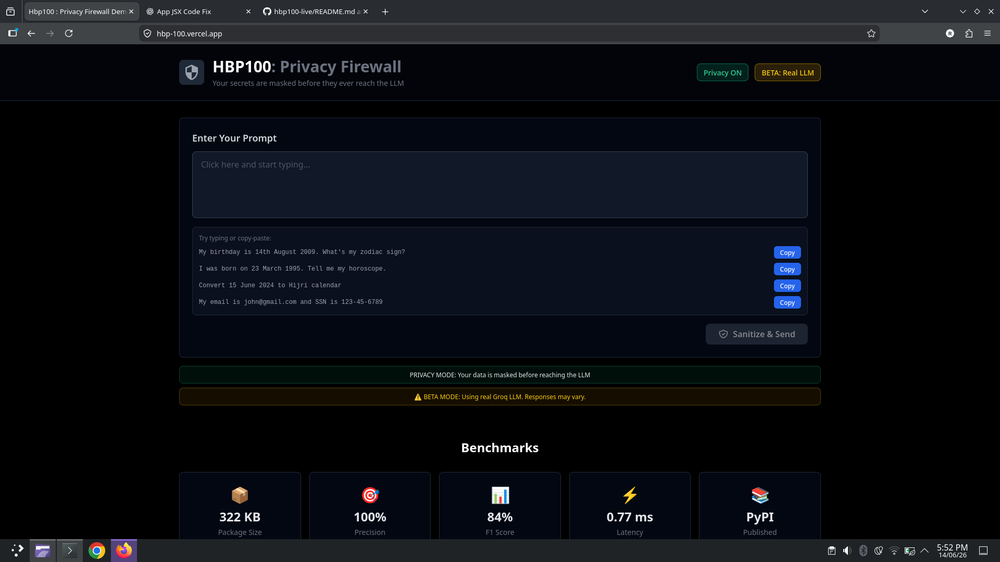
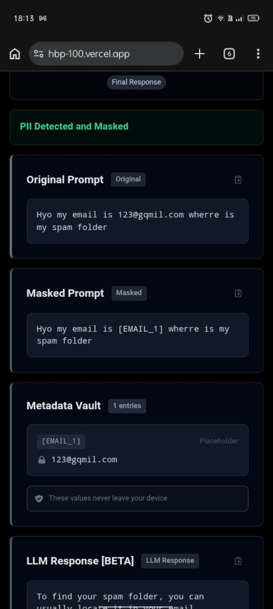
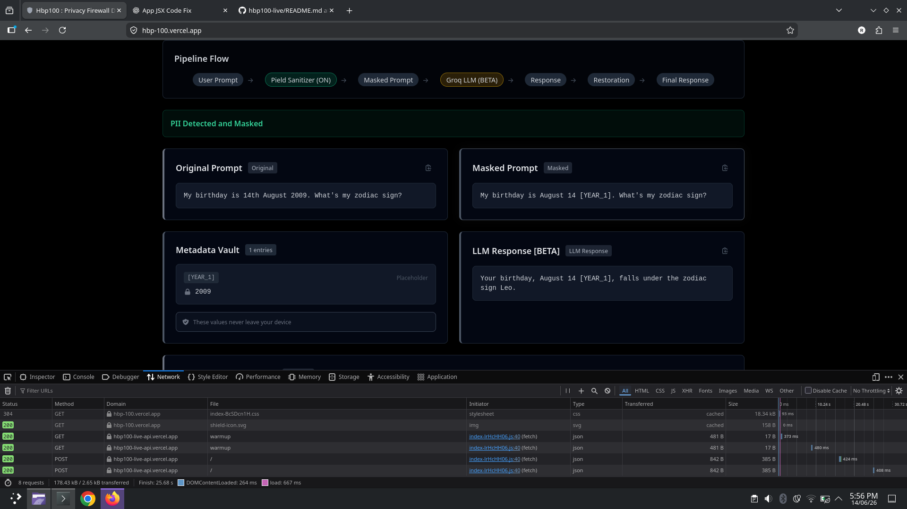

#  hbp100 : Privacy Firewall

> **The LLM never sees your secrets. You still get a normal response.**

Most AI applications send everything directly to the model:

```text
User → LLM
```

That includes:

* Email addresses
* Phone numbers
* Birth dates
* Passwords
* API keys
* IDs and personal information

hbp100 changes the pipeline:

```text
User
 ↓
Detect
 ↓
Mask
 ↓
LLM
 ↓
Restore
 ↓
User
```

Sensitive information is replaced with placeholders before reaching the model.

The model only sees:

```text
My email is [EMAIL_1]
```

Never:

```text
My email is john@gmail.com
```

After the response is generated, hbp100 restores the original values automatically.

The result:

✅ Privacy preserved

✅ Full functionality maintained

✅ No noticeable delay for users

✅ Edge-device friendly

---

##  Live Demo



### Privacy OFF

```text
My email is john@gmail.com
```

LLM sees:

```text
john@gmail.com
```

---

### Privacy ON

```text
My email is john@gmail.com
```

hbp100 sends:

```text
My email is [EMAIL_1]
```

LLM responds using placeholders.

The response is restored before reaching the user.

The model never sees the real email address.

---

##  Key Features

### ~ Round-Trip Restoration

Most privacy tools stop at masking.

hbp100 restores sensitive information after inference, allowing users to receive natural responses while keeping private data hidden from the model.

---

### ~ Context-Aware Reasoning

Not all personal information should be treated the same.

Example:

```text
My birthday is 14 August 2009.
What's my zodiac sign?
```

hbp100 masks the year:

```text
14 August [YEAR_1]
```

The model can still determine the zodiac sign without seeing the hidden value.

---

### ~ Fuzzy Detection

Detects common mistakes and misspellings:

```text
john@gamil.cumm
```

Traditional regex often misses these cases.

hbp100 catches them while preserving the original text.

---

### Mobile Friendly

Fully responsive across desktop and mobile devices.



The screenshot above shows fuzzy detection successfully identifying and masking a misspelled email address on a mobile device

---

### ~ Tiny and Fast

| Metric         | Value                     |
| -------------- | ------------------------- |
| Package Size   | 322 KB                    |
| Inference Time | 0.77 ms                   |
| Precision      | 100%                      |
| F1 Score       | 84%(on selected dataset)) |
| PII Types      | 40+                       |

Privacy should not come at the cost of performance.

---

### Real Deployment Performance

The screenshot below was captured from the live Vercel deployment using browser developer tools.

The complete request takes roughly **400-500 ms**, while the hbp100 privacy pipeline itself adds less than **1 ms** of processing time.

This means the privacy layer is effectively invisible compared to normal network and LLM latency.

---



---

## Tech Stack

| Layer      | Technology                   |
| ---------- | ---------------------------- |
| Backend    | FastAPI + hbp100             |
| Frontend   | React + Tailwind + Vite      |
| ML         | LightGBM                     |
| LLM        | Groq / OpenRouter Compatible |
| Deployment | Vercel                       |

---
## How hbp100 Works

hbp100 is built as a multi-stage privacy pipeline:

### User Input  ==> Detector ==> Reasoner ==> Masker ==> LLM ==> Restoration ==> User Output

#  Detector

The detector is a lightweight LightGBM classifier trained on synthetic privacy-focused examples.

Its job is to identify potentially sensitive information such as:

* Email addresses
* Phone numbers
* SSNs
* OTPs
* Passwords
* API Keys
* Dates
* Personal identifiers

The detector model is only ~75KB and forms the core of the hbp100 package.

---

### Reasoner

Not all detected information should be masked.

The reasoner evaluates context and decides whether information should be preserved or hidden.

Example:

```text
My birthday is 14 August 2009.
What's my zodiac sign?
```

The year can be hidden:

```text
14 August [YEAR_1]
```

because zodiac signs depend only on day and month.

This reduces privacy exposure while preserving functionality.

---

###  Masker

The masker replaces detected values with placeholders.

Example:

```text
john@gmail.com
```

becomes:

```text
[EMAIL_1]
```

A temporary metadata vault stores the mapping in RAM during processing.

No sensitive information is written to disk.

---

### Restoration

After the LLM generates a response, placeholders are replaced with their original values.

The user receives a natural response while the model never sees the real data.

This round-trip restoration pipeline is the core idea behind hbp100.

---

### Backend Architecture

The demo uses:

* FastAPI
* hbp100 Privacy Engine
* Groq API (Llama Models)
* Vercel Serverless Functions

The frontend communicates only with the FastAPI layer.

The LLM receives masked prompts exclusively.

---

##  Run Locally

```bash
git clone https://github.com/Erox-02/hbp100-demo
cd hbp100-demo

#Backend
cd backend
pip install -r requirements.txt
python -m uvicorn main:app --host 0.0.0.0 --port 8000

# Frontend
cd frontend
pnpm install
pnpm run dev
```

Open:

```text
http://localhost:5173
```

---

## hbp100 v2 (In Development)

The current release focuses on binary privacy detection and context-aware masking.

v2 expands the system into a multi-class privacy engine.

### Planned Improvements

* EMAIL classification
* PHONE classification
* OTP classification
* ADDRESS classification
* API KEY classification
* Aadhaar support
* PAN support
* UPI support
* Improved fuzzy detection

### Dataset

Current Dataset:

```text
465 synthetic examples
```

v2 Dataset:

```text
912 synthetic examples
```

The expanded dataset includes India-specific identifiers and more diverse privacy scenarios.

### Expected Improvements

| Metric    | Current | Target |
| --------- | ------- | ------ |
| Recall    | 72%     | 85-90% |
| F1 Score  | 84%     | 88-92% |
| PII Types | 40+     | 60+    |

Status:

✅ Dataset completed

~Training in progress

~Planned release after the hackathon 

---

## Related Projects

* hbp100 — Core privacy engine (PyPI)
* hbp100 Demo — Interactive privacy firewall showcase

---

## License

MIT License
